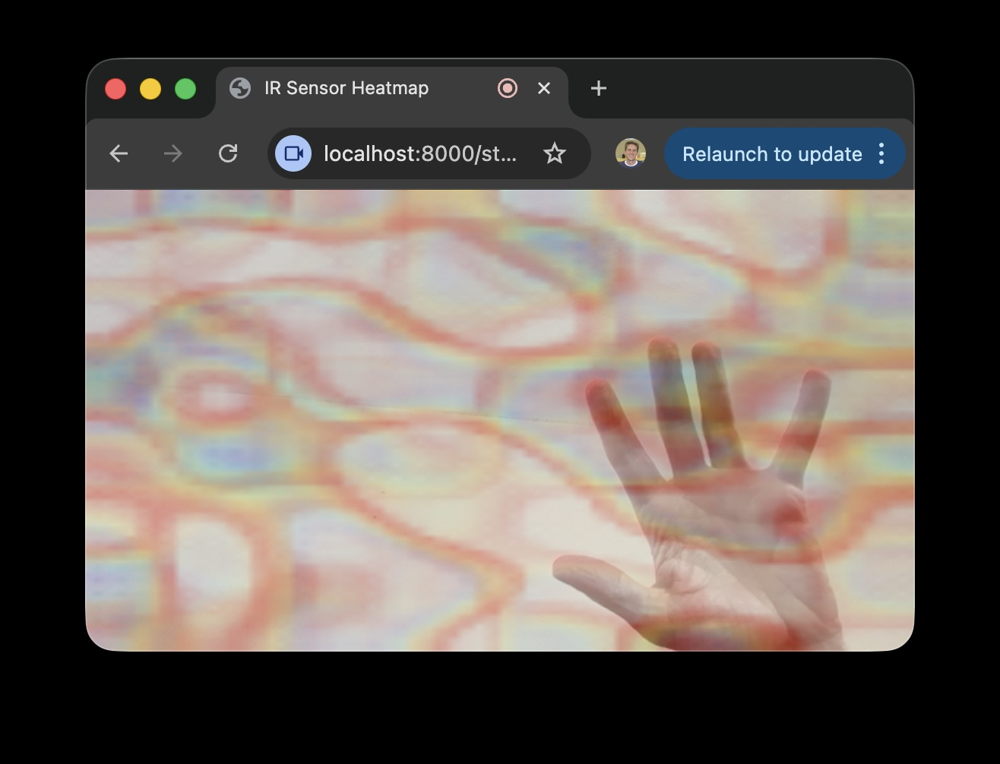
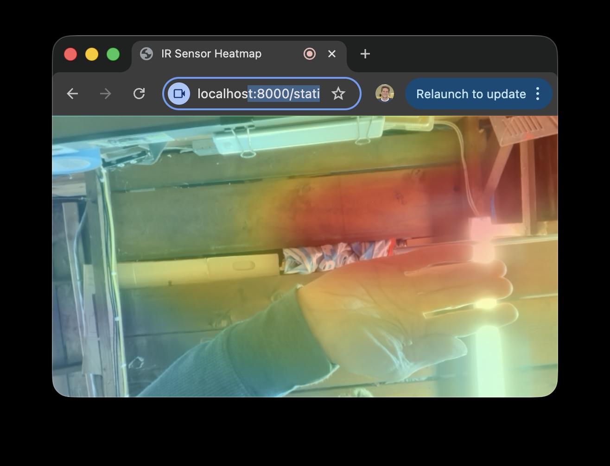

## Find warm things: Technical Learnings of Thermal Sensor for Make Benefit Me

Prototype for thermal data with live video overlay. 

To try this without an actual Panasonic `grideye` sensor https://www.adafruit.com/product/3538

1. Start test sensor that serves fake, random thermal data:
```shell
uv run -m poocam_core.random_sensor_process
```
2. In another terminal, start web app:
```shell
uv run -m poocam_web packages/poocam-web/
```
3. Open web browser to view (fake) thermal data:
```
open "http://localhost:8000/static/index.html"
```

It looks like:



To view _real_ thermal data from a Panasonic `grideye` https://www.adafruit.com/product/3538

1. On Raspberry Pi, start the process that serves sensor data from attached `grideye`
```shell
uv run -m poocam_pi
```
2. On your laptop, start web app. NOTE: laptop and Pi need to be on same network; _replace the last parameter_ with the IP of your Pi
```shell
uv run -m poocam_web packages/poocam-web/ 192.168.4.104 
```
3. Also on your laptop, open http://localhost:8000/static/index.html The page will ask to use your camera to show thermal info blended with video. NOTE: there is currently an issue with thermal data not aligning with video

It looks like: 



source: https://learn.adafruit.com/adafruit-amg8833-8x8-thermal-camera-sensor/raspberry-pi-thermal-camera

Setup on Raspberry PI:
```
sudo useradd -r -m -c "Service User Account" -s /sbin/nologin poosensor
curl -LsSf https://astral.sh/uv/install.sh | sudo env UV_UNMANAGED_INSTALL="/usr/local/bin" sh
sudo usermod -aG i2c poosensor
sudo su
cd /home/poosensor/
sudo -u poosensor git clone "https://github.com/jmccaughey/poocam.git"
cd poocam
sudo -u poosensor uv run -m poocam_pi
[copy poosensor.service to /etc/systemd/system/]
sudo systemctl enable poosensor --now 
```